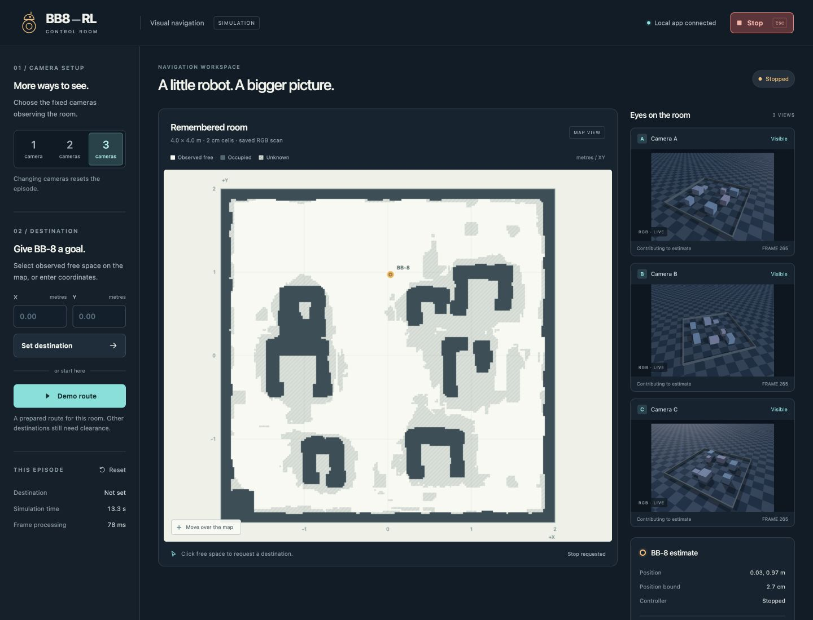
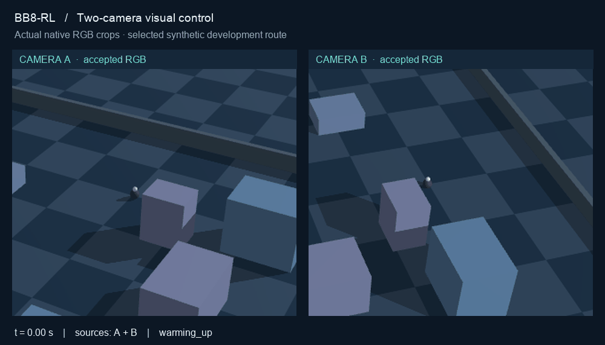
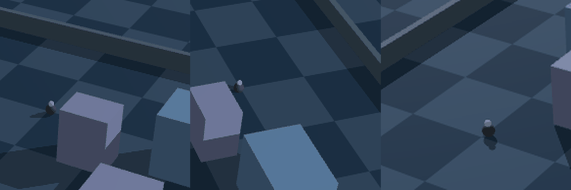
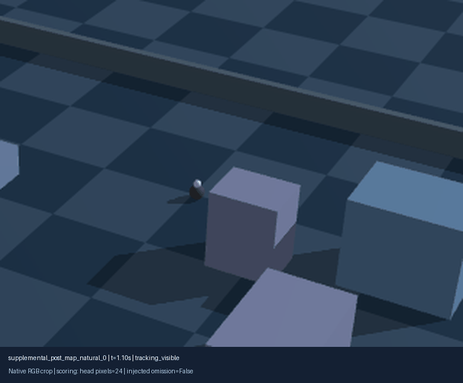
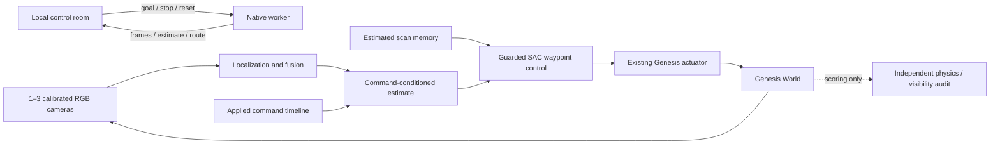

<div align="center">

# BB8-RL

### Camera-guided navigation in Genesis

An interactive research workspace for visual localization, estimated room memory,
reinforcement-learning control and bounded motion through camera occlusion.

[Quick start](#quick-start) · [Control room](#the-control-room) · [Evidence](#measured-evidence) · [Architecture](#architecture) · [Research](#research-and-development)

**Python 3.12 · Genesis World · One to three cameras · Simulation only**

</div>



BB8-RL is a separate project using [Genesis Studio](https://github.com/Nitish05/Genesis-Studio)
for scene authoring and construction. It adds its own navigation application,
camera perception, scan memory, training experiments and simulation adapter.
The control room accepts destinations on an estimated map and exposes the camera
evidence, route and uncertainty behind each motion request.

## The control room

| Capability | Behavior |
|---|---|
| Click-to-go | Select observed clear space or enter metric coordinates; route and stopping clearance are checked |
| Camera modes | Choose one, two or three fixed cameras; mode changes reset the episode |
| Live observation | Inspect native RGB feeds, accepted camera sources and measured/predicted position |
| Scan memory | Reuse an RGB-derived map with explicit free, occupied and unknown space |
| Occlusion handling | Use brief valid predictions; cancel the goal when localization expires and show a historical last-seen marker |
| Visual recovery | Validate returning observations across multiple frames; stay stopped until a new destination is requested |
| Stop and Reset | Cancel the goal, clear queued motion, or return to the demo start |
| Experimental exploration | Explicitly enable self-selected reachable places; remember outcomes and update place preferences across sessions |
| Reproducible evidence | Retain commands, model hashes and separate physics records for independent scoring |

**Destinations depend on map coverage.** A clear cell alone does not establish
that the robot footprint, route and stopping envelope are clear. Rejected goals
stay rejected; unknown space is never silently treated as traversable.
Route searches account for the current camera-position uncertainty, and every
returned segment is independently checked against the saved map.

Localization progresses through **uninitialized, measured, predicted, lost and
reacquiring** states. A short prediction is usable only within the existing
**one-second visual-loss limit** and **8 cm position-radius limit**, with valid
command timing and route/stopping checks. When localization expires, the old
goal is cancelled, current position and bound become unavailable, and a dashed
last-seen marker shows elapsed simulation time. Returning visual observations
must pass consistent multi-frame recovery checks; the robot then stays stopped
until you choose a new destination.

Recovery is local: observations must remain within **12 cm of the last valid
prediction, frozen when localization is lost**. This accounts for valid motion
after the last visual fix; the gray last-seen marker still shows that historical
visual fix. The recovery reference does not follow the growing expired
prediction. It is not global relocalization; use **Reset** if the robot is outside
that gate. See the [localization guide](docs/GETTING_STARTED.md#localization-loss-and-recovery)
and [M7.13 report](docs/M7_13_RESULTS.md) for behavior, evidence and limitations.

The current scan uses **48 calibrated RGB views** and retains **25.2% more
observed free cells** than the original bundle. Additional free space requires
four separated image supports; occupied and unknown evidence still constrains
motion. The [scan-coverage report](docs/M7_12_SCAN_COVERAGE.md) records all failed
reconstruction attempts, independent geometry checks and driving results.


## Quick start

The prepared workspace launches with one command:

```bash
./scripts/launch-control-room.sh
```

On macOS, you can also double-click `BB8-Control-Room.command` in Finder.

Open `http://127.0.0.1:8765` if your browser does not open automatically. Wait for
the scene and camera estimate, then select **Demo route** for the first run.
Keep the terminal open. **Stop** or **Escape** cancels motion; Ctrl-C closes the app.

For a fresh checkout, the tested platform is native Python 3.12 on Apple Silicon
macOS. Clone the projects side by side and install the recorded environment:

```bash
gh repo clone Nitish05/Genesis-Studio
gh repo clone Nitish05/BB8-RL
cd Genesis-Studio
git checkout cd20c8c685f2b51263814fd0a6296bfd849bdce6
cd ../BB8-RL
python3.12 -m venv .venv
.venv/bin/python -m pip install -r configs/navigation/requirements-macos-py312.lock.txt
.venv/bin/python -m pip install --no-deps -e ../Genesis-Studio -e .
./scripts/python.sh scripts/install-demo-assets.py
./scripts/launch-control-room.sh
```

Private repository/release access requires your own authenticated GitHub account.
The explicit installer verifies the pinned demo ZIP and its artifacts. It does
not train models or install files into Genesis Studio. The macOS lock is an
environment snapshot, not a guarantee for other platforms.

See the [setup guide](docs/GETTING_STARTED.md) for runtime selection, offline asset
installation and troubleshooting.

## Examples

**Scan once, then use one fixed camera**

```bash
./scripts/launch-control-room.sh --mode 1
```

Select **Demo route** to reset and request the short occlusion-development
destination. The scan is included in the bundle; this does not initiate a new scan.

**Use two or three views**

```bash
./scripts/launch-control-room.sh --mode 2
./scripts/launch-control-room.sh --mode 3 --port 8766
```

The in-app camera selector resets the robot and clears the prior goal. Fresh
compatible views contribute to fusion; conflicting or missing observations cannot
invent a measured position.



*Synchronized crops from the actual two-camera test. Camera B continues supplying
an accepted RGB position while camera A loses the robot.*

**Choose a destination**

Click the map or enter **X = 0.24746 m, Y = 1.30868 m** after Reset to reproduce the
demo endpoint. Other destinations must pass the same checks. The application
reports rejections and stops; it does not promise every click is reachable.


*Previously rejected destination `(1.35545, -0.84464)`, starting near
`(-0.14400, -0.06205)`. Actual two-camera RGB replay at 2× simulation speed;
the run arrives in 29.85 simulated seconds. One- and three-camera runs are
recorded separately in the [scan-coverage report](docs/M7_12_SCAN_COVERAGE.md).*

**Let BB-8 choose a destination**

Select **Start exploring** in the experimental exploration panel after the camera
position is ready. BB-8 chooses among estimated-map places with certified routes,
then uses the existing guarded SAC controller to reach the selected place. The
panel explains the intention and shows remembered outcomes. Successful and
rejected routes update a small learned value model; proposals alone do not.

**Pause exploration**, **Stop**, a manual destination, Reset, a camera-mode
change, a lost browser heartbeat or expired localization cancels exploration.
Memory remains, but movement never starts automatically after a restart or
visual recovery. The default SQLite file is `work/agency/bb8.sqlite3`; use
`--agency-memory /path/to/memory.sqlite3` to select another file.

This is an initial **learned place-choice experiment**, not a completed social
personality. Its designed utility currently measures navigation outcomes. A
separate compact Qwen vision-language trial can rank offered visual-attention
IDs, but is **not connected to live movement**. See the
[implementation plan](docs/AGENCY_PLAN.md), [controlled comparisons](docs/AGENCY_EXPERIMENT.md)
and [local model trial](docs/SEMANTIC_TRIAL.md).



*Recorded Genesis RGB, with self-selected places. Three-camera validation reached
three goals across two distinct places. The one-camera attempt stopped after
localization loss; both outcomes are retained in the [native report](docs/AGENCY_NATIVE_RESULTS.md).*

## Measured evidence



*M7.8 native RGB replay: one fixed camera after a synthetic scan. The robot moves
behind an obstacle, predicts through visual loss, reappears and reaches the goal.
This is a selected development route.*

| Experiment | Recorded result | Scope |
|---|---|---|
| Autonomous place choice | Three-camera run: 3 valid trips; one-camera run: 0 arrivals, localization-loss stop | One synthetic room, two distinct reached places; [full results](docs/AGENCY_NATIVE_RESULTS.md) |
| Localization loss and recovery | 9/9 fixed native outcomes; recovery after a five-second input outage; zero contacts or premature arrivals | M7.13; unchanged motion limits, explicit new goal after recovery |
| Improved scan and reported destination | 25.2% more observed free space; one / two / three cameras arrive in 29.75 / 29.85 / 30.15 simulated seconds | M7.12; same room, unchanged control limits |
| Revised-map regression | 12/12 intended outcomes: 10 valid arrivals and 2 braking controls; zero contacts or premature arrivals | Full second family; all 24 development attempts retained |
| Interactive one / two / three cameras | All three modes reached the selected goal with independently valid arrival | M7.9; one shared development path |
| Interactive failure controls | Stop, camera handover, all-view loss and invalid memory passed; 7/7 total worker cases | 758 captures, zero contacts or premature arrivals |
| Single-camera scan-memory traversal | 6.70 cm between fully hidden captures; maximum hidden error 1.36 cm; visible arrival without contact | One selected M7.8 route |
| Arrival check | 3.38 cm distance, 0.55 cm/s speed, 0.595 s true dwell | Original 10 cm / 3 cm/s / 0.5 s gate |
| Dropout / invalid-memory controls | 3/3 supplemental controls passed | Recovery and braking from motion |
| Original scan-memory cases | 0/6; map rejects the routes | Failures retained separately |
| SAC / Dreamer baseline | Each checkpoint reached 200/200 synthetic held-out goals | M6 uses oracle state/map; **not camera performance** |

The [scan-coverage report](docs/M7_12_SCAN_COVERAGE.md) records the current map,
all reconstruction attempts, and both complete native regression families.
The earlier [interactive validation report](docs/M7_9_VALIDATION.md) records its
one/two/three-camera runs and Stop/recovery checks separately, with a
[machine-readable summary](docs/evidence/m79-native.json). See
[M7.8](docs/M7_8.md) and [capture-level evidence](docs/media/occlusion-evidence.png)
for the preceding experiment.

## Architecture



The server binds only to loopback. A spawned process owns Genesis and the models,
keeping the interface responsive during rendering. Goal generations prevent stale
requests from resuming after Stop or reset. Browser heartbeat loss cancels motion.
RGB estimates, map evidence and command acknowledgements feed control; simulator
pose, velocity and renderer masks are isolated to scoring.

The original raw prediction bound remains in diagnostics even after it becomes
unusable and continues growing. A separate conditional braking region describes
stopping under declared model assumptions; it cannot authorize motion or arrival,
replace the current position estimate, or shrink that original bound. A zero
command is not a measurement that the robot is stationary.

Simulation runs in **lockstep**: physics pauses while perception runs. Fast
inference measurements do not establish real-time physical robot performance.

## Research and development

| Area | Documentation |
|---|---|
| Autonomous exploration | [Plan](docs/AGENCY_PLAN.md) · [Learning experiment](docs/AGENCY_EXPERIMENT.md) · [Native validation](docs/AGENCY_NATIVE_RESULTS.md) |
| Personality research and semantics | [Research](docs/research/personality/RESEARCH.md) · [Local Qwen trial](docs/SEMANTIC_TRIAL.md) |
| Interactive application | [Plan](docs/M7_9_PLAN.md) · [Validation](docs/M7_9_VALIDATION.md) · [User guide](docs/GETTING_STARTED.md) |
| Localization loss and recovery | [Plan](docs/M7_13_PLAN.md) · [Research decision](docs/M7_13_RESEARCH.md) · [Implementation and results](docs/M7_13_RESULTS.md) |
| Scan coverage | [Reconstruction and route results](docs/M7_12_SCAN_COVERAGE.md) · [Plan](docs/M7_12_PLAN.md) |
| Scan-once navigation | [Occlusion control](docs/M7_8.md) · [Map and registration refinement](docs/M7_7.md) |
| Multi-camera perception | [Fusion and memory](docs/M7_5.md) · [Fast observation](docs/M7_6.md) |
| Learned navigation | [SAC / Dreamer control](docs/M6.md) · [Training guide](docs/M4.md) |
| Camera research | [Papers and approach](docs/M7_RESEARCH.md) · [Vision](docs/M7_2.md) · [Map refinement](docs/M7_3.md) |
| Foundations | [Project boundaries](docs/M0_M1.md) · [Synthetic room](docs/M2_SYNTHETIC.md) · [History](docs/PROJECT_HISTORY.md) |

```text
src/bb8_rl/       Application, cameras, mapping and guarded control
scripts/         Launchers, training, asset packaging and audits
projects/bb8/    Authored synthetic scenes and tasks
configs/         Runtime/training settings and pinned release
tests/           Control, perception, application and native checks
docs/            Guides, research reports and selected media
work/            Local models, datasets and evidence — ignored by Git
```

```bash
./scripts/python.sh -m pytest -m 'not genesis and not native_gui' -q
./scripts/python.sh -m ruff check src tests scripts
```

CI tests pure camera/control/application contracts without native graphics or
model assets. The M7.13 local non-native suite passed **584 tests**. Current native
and browser acceptance are documented in the [localization report](docs/M7_13_RESULTS.md);
the earlier application checks remain in the [validation report](docs/M7_9_VALIDATION.md).
The [route-clearance correction](docs/M7_10_ROUTE_FIX.md) documents the subsequent
uncertainty-aware planner and arrival-settling regression.

The [clearance comparison](docs/M7_11_RESULTS.md) tests seven configurations in
14 tuning runs. The selected interactive default uses a **3 cm fixed margin**,
**15 cm/s speed cap** and **4 cm route-search reserve** for braking room. It
completed both tuning routes and all seven separate validation cases, including
one-to-three-camera driving and Stop/dropout/invalid-map controls. Wider planned
paths can reject tight destinations; these results cover one synthetic room.

## Current boundaries

- Synthetic dimensions, dynamics and calibration assumptions; no physical robot
  connection. Scan cameras have known metric poses.
- One static room and selected development routes; no general success-rate claim.
- Unknown/insufficient map coverage still blocks some destinations. The original
  six-case scan-memory native results remain historical failures; new static
  coverage checks are reported separately.
- Uncertainty/response bounds are assumptions, not calibrated physical guarantees.
  Visible arrival is independently checked against physics.
- Scene or camera changes require validated memory/calibration. Automatic
  real-room scanning and change detection remain future work.

## Assets and attribution

The release contains project-trained SAC/vision checkpoints and estimated
synthetic scene artifacts. Upstream reconstruction/matching weights are not
redistributed. See [asset notes](docs/PUBLISHING.md) for provenance and checksums.

This independent project is not an official or endorsed character product. Robot
geometry uses schematic primitives. No software license has been selected;
repository access does not itself grant a reuse license.
