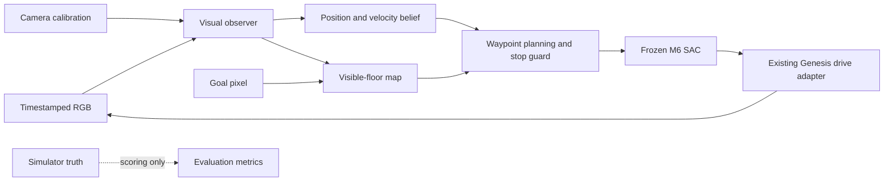

# M7.1 camera-control implementation and first measurements

The [research review and staged plan](M7_RESEARCH.md) select calibrated visual
belief control, with SAM 3.1 segmentation teaching and TAPNext++ tracking as the
next learned-perception components. The implemented first stage is an RGB-only
integration baseline. **No SAM, TAPNext or distilled student weights have been
run or trained in this milestone.**

## Implemented boundary

`src/bb8_rl/camera.py` accepts only calibrated RGB, capture timestamps, a pixel
goal and known robot head height. It imports no environment, Genesis entities or
hardware. Its policy callback consumes the five-dimensional M6 waypoint feature
vector reconstructed from visual estimates. A separate harness owns rendering,
scenario reset, actuation and ground-truth scoring.



The current observer detects the small neutral-colored head and the synthetic
blue checkerboard floor. It projects the head centroid onto its declared 8.3 cm
height plane, not directly onto the floor. A causal constant-velocity Kalman
filter estimates planar position/velocity. Its noise parameters are heuristic;
the covariance is not yet a calibrated statistical guarantee.

The initial map is built from camera-classified visible floor and robot pixels.
It samples grid centers/corners at 5 cm resolution, marks other pixels unknown,
inflates obstacles/unknown space using body radius, margin and position uncertainty,
then calls the existing A* planner. It replans when uncertainty grows or the route
becomes invalid. The map assumes a stationary calibrated camera and static scene;
it does not yet track moving obstacles or detect camera displacement.

The controller commands zero for missing/ambiguous/outlier observations, excessive
uncertainty, frame age over 100 ms, repeated timestamps or unavailable routes.
Zero commands request the existing bounded braking response; they do not freeze
physical velocity. Native camera loss testing confirmed zero commands and later
reacquisition. The core filter separately rejects non-increasing timestamps.

Calibration currently assumes rectified ideal pinhole RGB. Synthetic calibration
comes from the renderer; a physical camera needs measured intrinsics/extrinsics,
scale and distortion correction. Projected goal pixels in the development harness
represent externally specified goals, not robot-state feedback. There is no live
click-to-go UI or physical camera capture loop yet.

## Run

From BB8-RL, using the existing M5/M6 runtime and checkpoint:

```bash
export BB8_PYTHON="$PWD/.venv-dreamer/bin/python"
./scripts/python.sh scripts/run-camera-pilot.py --output work/my-camera-pilot --count 12
./scripts/python.sh scripts/run-camera-pilot.py --output work/my-camera-dropout --count 3 --dropout-start-step 40
./scripts/python.sh -m pytest -m 'not genesis and not native_gui' -q
```

The default SAC checkpoint is `work/m6/sac-2/model.zip`. The scenario inputs come
from the first 12 authored M6 validation records. Supply `--checkpoint` and
`--cases` to relocate those artifacts. These are development replays, not fresh
held-out camera tests. The original 10 cm / 3 cm/s / 0.5 s arrival gates remain.
After 20 consecutive guarded frames (one simulated second), the pilot records a
perception abort. Aborted episodes are failures, never arrivals.

Every run saves a source/machine manifest, calibration, estimated and scoring
trajectories, actions/statuses, camera maps, initial/final annotated RGB and timing
summaries. Green circles show estimated ground position, pink stars the goal and
yellow lines the camera-derived route. Only RGB is requested by the control run;
the separate diagnostic audit requested segmentation for scoring, not control.

## Development results

The final baseline ran 12 authored development scenarios: **1 arrival, 11
perception/route aborts, zero collisions**. Its success rate is not close to the
camera acceptance target; the M6 200/200 state-based result does not carry over.
The earlier 4-case runs are subsets/repeats, not additional independent cases.

The successful case arrived in 12.10 simulated seconds with 3.17 cm error and
0.00724 m/s final speed. Its visible localization p95 error was 6.33 mm. A matched
five-frame blank-image test commanded zero on all five frames, reacquired the
robot and arrived in 12.35 seconds without collision. This is one dropout example,
not a general robustness claim.

The map audit explains why learned segmentation is the next priority. Some shaded
obstacle faces have colors indistinguishable from floor under this palette test.
Ground-truth segmentation confirmed these pixels belong to obstacles, and reported
object positions agreed with the scene configuration. The issue is appearance
classification, not evidence of a calibration/physics-position discrepancy.

On the four-case map audit, camera-free cells conflicted with 25–43 cells in a
geometric occupancy reference (including cell half-diagonal margins), while only
about 70–81% of reference-clear cells were retained. Simultaneously false-free and
false-blocked regions make this a **heuristic map**, not a conservative guarantee.
No oracle mask was substituted to improve the runs. Zero contacts on this small
set do not establish safety outside the executed paths.

In the verified 4-case timing rerun, observer+policy p95 was 4.0–15.2 ms by case;
the full observer+physics+render cycle p95 was 24.6–45.3 ms. These are local simulator
measurements, excluding initial scene setup and physical capture/transport. They
do not establish SAM/TAP/student latency. Rendering emitted an existing OpenGL
cubemap warning; returned RGB was visually inspected and valid, but broader
appearance-fidelity claims are not made.

52 non-GUI tests passed. The six new tests cover height-correct projection, RGB
localization/ambiguity, causal velocity estimation, outlier/dropout handling,
unknown-space planning, blocked goals and stale/repeated-frame stopping. Native
Genesis rendering exercised the closed loop and injected dropout. All arrivals
were checked against the original gates and all guarded/dropout actions checked
to be zero. Existing physics and Studio source were not modified.

## Next implementation

Implement the M7.2 dataset and learned visible-floor/ground-position student next.
Use simulator labels only during training/scoring, include the shaded-face failure
cases and split whole scene/camera/appearance sequences. Add SAM 3.1 pseudo-labels
on reviewed real video once an authorized checkpoint and compatible inference
runtime are available. Compare TAPNext++ tracking with the local temporal student.

Measure false-free occupancy and visibility errors before expanding autonomy.
Distinguish segmentation mistakes from genuinely hidden floor: a better model
cannot verify arbitrary hidden geometry from one view. A room survey, alternate
camera pose or additional view may be required for goals the fixed camera cannot
observe. Unverified space must not be silently declared free to increase arrivals.
