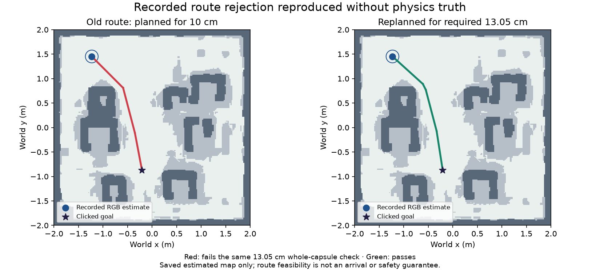

# Uncertainty-aware interactive routes

The reported click from approximately (-1.23, 1.45) m to (-0.21, -0.87) m
exposed a mismatch between planning and checking. The application searched a
fixed 10 cm inflated grid, but the controller required 13.0469 cm: 3.7 cm robot
radius, 4 cm clearance margin and 5.3469 cm RGB position uncertainty. The returned
path failed the larger independent capsule check, although a wider path existed.

The application now searches with the current required radius, rounded upwards
to a 2 cm grid-cache bucket. The controller independently checks every returned
segment against the original map evidence. If clearance is lost during motion,
the controller requests zero and discards that route; a later accepted visible
fix is required to plan another. Unknown space, frozen memory versions and
stopping-envelope checks remain authoritative. No policy or actuator changes
are involved.

## Evidence and preserved failures

A replay of 21 recorded RGB observations and command acknowledgements reproduces
the old rejection and accepts a route with the corrected radius. It consumes no
simulator pose, velocity or renderer labels. The native reproduction changes only
the demo start and goal in a copied, checksum-validated asset bundle; its map,
camera calibrations, scene and learned checkpoints remain identical.

The [recorded replay summary](evidence/m710-route-replay.json) retains the exact
coordinates, route-segment outcomes and source hashes.

The first route-fix trial traversed the requested path in both modes without
contact or any `route_not_certified` state. One-camera arrival at 36.45 s failed
the independent original dwell check: 0.480 s rather than 0.500 s. At dwell start,
the nominal estimated speed was 2.2745 cm/s while actual speed was still
3.2177 cm/s. Three-camera arrival at 38.20 s passed with 0.505 s true dwell.
Both initial attempts remain under `work/m710/native-v1` and `work/m710/audit-v1`.
They are not combined into an overall success rate.

The arrival correction adds a zero-command settling interval before the existing
full 0.5 s visible dwell. Its duration uses the current estimated speed plus
velocity radius and the already-declared saturated/exponential braking response.
This shares the stopping-envelope model's conditional zero-command braking
assumption; it is not a guarantee against sustained external accelerations or a
claim of calibrated physical behavior. The original independent 10 cm / 3 cm/s /
0.5 s arrival gate remains unchanged.

The final source passes **446 non-native tests**, with 20 native tests excluded
from that selection, and Ruff. New checks cover current-uncertainty planning,
unsafe planner output, visible-only replanning, bounded grid caching, braking-tail
timing and resetting the arrival timers on interruptions.

The corrected native reruns pass the unchanged independent arrival gate:

| Reproduction | Arrival time | True distance | True speed | True dwell |
| --- | --- | --- | --- | --- |
| Reported route, one camera | 36.65 s | 2.014 cm | 0.430 cm/s | 0.680 s |
| Reported route, three cameras | 38.40 s | 2.318 cm | 0.397 cm/s | 0.705 s |
| Original one-camera demo | 5.10 s | 3.316 cm | 0.356 cm/s | 0.745 s |

Both reported-route reruns have zero contacts, boundary violations or premature
arrivals. The one-camera case retains 734 captures and 7,340 physics intervals;
the three-camera case retains 769 captures and 7,690 intervals. Their respective
136 and 150 transient stopping-envelope guards remain in the results; these
conservative pauses are not bypassed. Neither run reports `route_not_certified`.

The original demo also passes. Across the three final cases, the independent
scorer verifies 1,606 captures, 6,288 RGB/mask images and 16,060 physics/command
intervals, with zero contacts or premature arrivals. The
[sanitized native summary](evidence/m710-native.json) records source/artifact
hashes, per-case results and the preserved initial failure.

Generated replay, native and independent scoring artifacts stay under ignored
`work/m710`. These are selected development checks in the existing synthetic
room, not general navigation reliability evidence.
