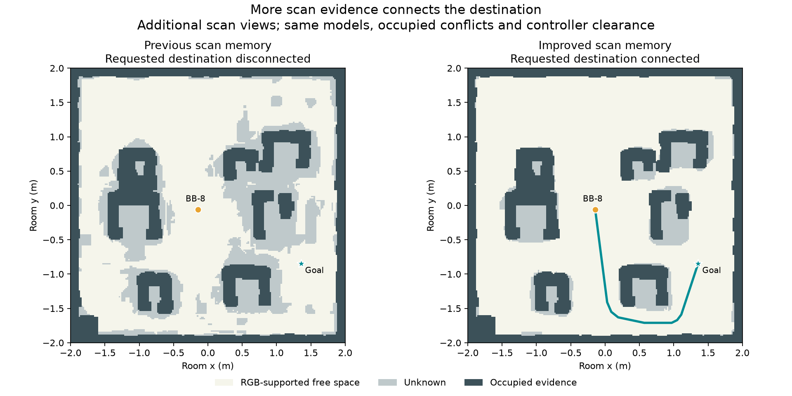
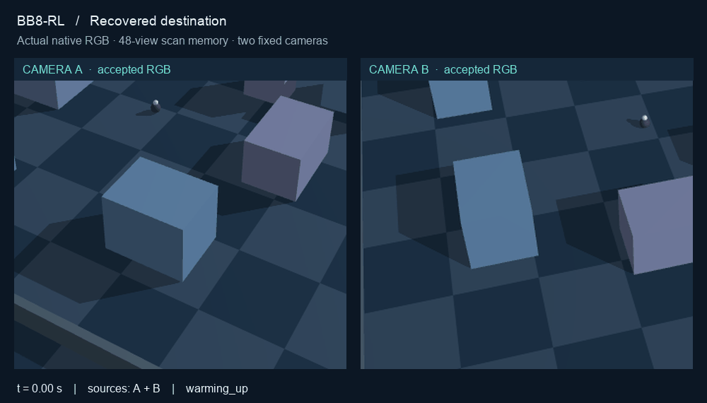

# Recovering passages from scan evidence

The camera showed a usable gap, but the saved RGB map did not contain enough
observed free space to drive through it. This work improves the scan evidence
while retaining the selected controller: 3 cm fixed margin, 15 cm/s speed cap,
4 cm route-search reserve, and the existing uncertainty and braking checks.

## What the map was missing

The reported destination is `(1.35545, -0.84464)` from the observed position
`(-0.14400, -0.06205)`. The robot body is 7.4 cm wide. An offline scoring-only
geometry diagnostic finds a 52.38 cm physical opening; the old RGB map retains
only a 6 cm strip of observed free space at the inspected cross-section. The
remaining area is unknown. Removing the planning reserve does not connect this
route, and adding live cameras changes localization, not the saved map cells.
Authored obstacle geometry is used only to audit reconstruction and motion.

## Scan once, then fix the cameras

One camera is moved through 28 additional overhead positions while the robot is
parked. Nine positions form a 3 × 3 grid at 3.2 m height; three wider views are
at 4 m. Sixteen half-offset grid positions at 3 m add overlap for the stricter
evidence rule. The positions and capture settings are fixed before capture. These RGB
images supplement the original 20 mapping images. Four reserved query views
remain excluded; the one-to-three live navigation cameras and their estimated
registration remain unchanged.

The original accepted floor masks and occupied conflicts are retained. New
floor masks intersect the frozen learned observer, synthetic color candidates,
and cross-view agreement under a floor-plane homography. Full expanded body
prisms must project entirely into positive floor evidence. New free cells
require four mutually separated supporting views and a two-pixel border guard,
in addition to the unchanged 5 cm metric projection guard and 12 cm body height.
Previously accepted free cells retain their original three-view evidence.
Unknown cells remain blocked; missing reconstruction does not create free space.

This uses known synthetic metric scan poses and a static, grounded room. It is
an improvement to the prepared scan pipeline, not automatic real-room SLAM or a
physical safety guarantee.

## Retained unsuccessful experiments

| Candidate | Added free cells | False-free prisms | Reported route at 14 cm | Decision |
| --- | ---: | ---: | --- | --- |
| Grounded-column assumption, original images | 4,508 | 184 | Disconnected | Rejected before motion |
| Extra 12 views, original three-view / one-pixel rule | 5,624 | 3 | Connected | Rejected before motion |
| Extra 12 views, four-view / two-pixel rule | 4,567 | 0 | Disconnected | Rejected before motion |

The independent audit checks complete voxel/prism volumes against static
colliders and the parked robot. It also verifies source hashes, excluded views,
occupied-evidence preservation and a frozen route set. Failed coordinates are
not supplied to reconstruction or used to repair maps. Every attempt is retained;
no failed map is installed in the control room.

## Accepted static reconstruction

The 48-view candidate passes the unchanged whole-volume geometry gate. It has
zero final or pre-conflict false-free prism intersections, zero free voxels
inside static obstacles, and zero overlap with the parked robot. Source hashes,
all prior 32 floor masks, occupied records and high supporting-view bits pass
the independent integrity checks. The [complete four-candidate audit records](evidence/m712-map-audits.json)
retain the failed attempts as well as this result.

| Map measure | Original scan | 48-view scan |
| --- | ---: | ---: |
| Free cells | 21,891 | 27,413 |
| Occupied cells | 9,622 | 9,622 |
| Unknown cells | 8,487 | 2,965 |
| Observed free floor area | 8.76 m² | 10.97 m² |
| Reported route, 14 cm radius | Disconnected | 3.402 m certified route |

The new map adds **25.2% more observed free cells**. The default-radius route
uses a southern detour; this does not establish that the visible central gap is
traversable at that radius. A 10 cm map-only path is 1.740 m; 18 cm remains
blocked. The controller still chooses radius from the body, margin, current
camera uncertainty and planning reserve.

Across the fixed 11 case IDs, connectivity is 10/11 at 10 cm, 6/11 at 14 cm and
5/11 at 18 cm, with no lost baseline connection. Of the six original M7.8 cases,
only `natural_0` becomes connected at 14 cm. The other five remain blocked at the
start or endpoint connection. These are map-only checks with the original camera
fixture retained in the protocol, not new native successes for those cases.

## Validation protocol

The [plan](M7_12_PLAN.md) fixes the promotion requirements. Static coverage uses
11 case IDs at 10, 14 and 18 cm radii, including all six original M7.8 cases;
these contain eight distinct endpoint pairs. Connectivity is not a native
arrival result. The original M7.8 camera and dropout cases are kept separate
from the interactive camera fixture.

Native validation uses the exact reported start and goal with one, two and
three cameras, plus all nine prior configuration-comparison cases. It retains
the independent 10 cm position, 3 cm/s speed and 0.5 s physical dwell arrival
checks with fresh visible RGB. Stop, stale-goal, all-camera-loss and invalid-map
controls retain their full observation windows. Rejected goals and timeouts
count as failed attempts.

## Runtime route-search correction

The first complete native family records **9/12 intended passes**, including
seven valid arrivals and both braking controls. The three reported-goal runs
remain failures: they reject the goal before movement. The
[preserved first-family report](evidence/m712-native-before-route-fix.json)
retains all 12 attempts, 5,916 camera captures and 21,500 verified image artifacts.
There are no contacts, premature arrivals or provenance failures.

The map is connected at the actual required clearance, but a conservative
cache optimization prevents the route from being found. In modes two and three,
`0.14 / 0.02` evaluates just above seven, so `ceil` selects 16 cm instead of
14 cm. In mode one, the initial RGB uncertainty genuinely requires
14.0003107 cm; a 16 cm bucket is conservative but unnecessary. All three
logged initial measurements have independently checked routes at their exact
required radii on the unchanged estimated map.

The correction compares the quantized product against the actual requirement,
without an epsilon. It prefers a wider cached route when one exists; if that
search fails, it retries the exact required radius. Every returned segment is
checked at the complete requirement, including the full 4 cm reserve. A value
even one floating-point step above a boundary cannot be rounded below itself.
Both coarse and exact grids share a bounded cache. The map, models, controller
limits, arrival checks and failure-control windows remain unchanged.

## Driving results after the correction

The complete second family passes **12/12 intended outcomes**: ten independently
valid visible arrivals and both braking controls. All 4,114 capture records,
41,140 physics samples and 14,308 saved image artifacts pass the independent
audit. There are no contacts, boundary violations, premature arrivals or
command/provenance failures. See the [final native report](evidence/m712-native-after-route-fix.json)
and [paired comparison](evidence/m712-native-comparison.json).

| Reported destination, from the reported start | Arrival time | Final distance | Physical dwell |
| --- | ---: | ---: | ---: |
| One camera | 29.75 s | 3.13 cm | 0.740 s |
| Two cameras | 29.85 s | 2.93 cm | 0.750 s |
| Three cameras | 30.15 s | 2.93 cm | 0.775 s |

Times are simulated seconds in lockstep, not wall-clock performance. All three
finish below 0.37 cm/s. The seven other arrival cases include the prior forward
and return routes, other camera-mode routes, the occlusion demo, and recovery
after all views disappear. Stop/stale-goal and invalid-map cases brake as required.

The replay uses actual captured RGB at 2× simulation speed. The first failed
family remains in the comparison: **24 total attempts are retained**, with no
replacement of failed cases by selected retries. The final family alone passes
all its predeclared cases. Route diagnostics are latched per attempt; 4,114
records do not mean 4,114 independent route searches.

The live browser also reaches **Arrived visible** from the default reset start
with one camera after entering `(1.35545, -0.84464)`. Coordinate inputs now accept
arbitrary decimal values, matching the existing map-click API. This additional
interface check is separate from the fixed twelve-case native family.

The code passes 516 non-native tests, lint, frontend syntax and coordinate checks.
Legacy 20- and 32-view maps preserve their previous data and planning behavior;
only scans requiring more supporting-view bits use the wider storage.

## Install and reproduce

The [v0.1.1 release](https://github.com/Nitish05/BB8-RL/releases/tag/v0.1.1)
contains `bb8-demo-assets-v2.zip`, with the accepted map and unchanged trained
models. Follow the [upgrade instructions](GETTING_STARTED.md) to preserve the old
bundle and install the new pinned archive. The original release remains available.

The separate `bb8-scan-evidence-v1.zip` contains the frozen RGB captures, masks,
baseline, failed candidates, accepted candidate, source snapshots and audits.
Its included instructions replay reconstruction and independent geometry scoring
from the retained baseline. Extract it only in a **fresh checkout**: it restores
the old baseline under `work/interactive-assets` for exact input bindings.
It does not contain all native image logs or reproduce earlier model training.
The runtime bundle is sufficient for driving; the evidence archive is optional.

These results cover one synthetic room with calibrated scan poses and static
grounded objects. They do not establish general navigation reliability. Some
destinations remain unreachable, and the original six M7.8 native failures are
not relabeled as successes by this work.
