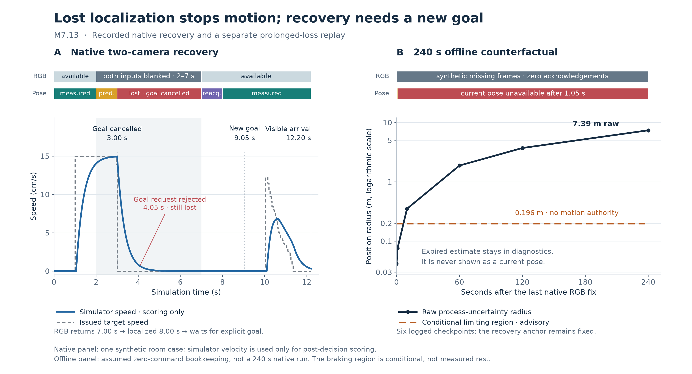

# Occlusion uncertainty and visual recovery

24 September 2026 · synthetic Genesis room · unchanged v2 scan/model bundle

This implements the user's requested occlusion/lost-localization follow-up. It is
recorded as M7.13 because the historical M4 remains the SAC/HER training milestone.
The [plan](M7_13_PLAN.md) and [primary-source research](M7_13_RESEARCH.md) were
written before implementation; the plan records the failed first native family
and the correction made before the second family.



The [plotted data and provenance](evidence/m713-plot-data.json) distinguish actual
native captures from the counterfactual offline extension.

## What changed

The reported 719.2 cm circle was an expired engineering error enclosure, not
observed robot travel. Persistent acceleration mismatch gives the old predictor
a nonzero velocity-error floor. Even when its nominal velocity settles, the
position enclosure grows by approximately 1.836 m per simulated minute.

Localization now has an explicit lifecycle, independent of a requested goal:

- **Measured / predicted:** a usable observer estimate; prediction still requires
  the existing one-second and 8 cm limits and complete command timing.
- **Lost:** cancel the route and pending goal, request braking, reject new goals,
  and publish no current usable position or radius. The map shows a dashed
  historical last-seen marker with its age instead of the expired circle.
- **Reacquiring:** validate a fresh sequence of returning visual observations
  while commands remain zero. One detection or repeated stale frame cannot
  restore localization. Existing position, innovation and velocity warm-up
  checks still apply.
- **Recovered:** publish the fresh position and remain stopped. The cancelled
  destination never resumes automatically; a new user goal is required.

The persistent observer supplies all public pose/source/last-seen fields. A new
controller has its own conservative velocity initialization, and its independent
uncertainty-expiry check can still cancel motion. This avoids mixing a measured
label from one belief with a predicted pose from another.

Recovery uses a **12 cm association gate around the last valid prediction**,
copied before the loss-triggering capture is processed. That reference stays
fixed through loss and rejected observations, and is invalidated by a map or
calibration change. It is separate from the historical visual marker. Recovery
outside this local gate needs Reset; global relocalization and identity proof
remain outside this implementation.

Stop, Reset, camera-mode reset and Demo remain available while lost. Demo resets
the episode before requesting its prepared route. New HTTP goals are also
rejected before initial localization. Internal startup/demo fixtures may wait
for their first valid fix, but cannot move before the existing warm-up checks.

## The failure that changed the recovery reference

The first complete native family passed **8/9 intended outcomes**. The long
all-camera outage stopped without contact and rejected the submitted goal, but
never recovered. Returning RGB was **21.00 cm** from the last visual position
after permitted blind motion. A gate centred on that old observation rejected it.

At `t = 2.95 s`, the last valid prediction was `(0.15849, 1.17013) m`, with a
6.43 cm position radius and one-second observation age. Returning RGB was only
**6.11 cm** from that prediction. Freezing this reference fixes the association
error without increasing the 12 cm threshold, allowing indefinite prediction,
or using simulator truth in recovery.

The first startup attempt also exposed a benchmark queue issue: heartbeats
filled the queue during renderer initialization. The harness now skips full
heartbeat writes and retries, preserving strict delivery for meaningful goal
and Stop commands. That zero-capture attempt and all nine first-family results
are retained in [the development record](evidence/m713-native-v2.json).

## Native loss and recovery

The frozen [nine-case protocol](../configs/interactive/localization-recovery-cases.json)
keeps the original endpoints, outage windows, control profile and arrival gate.
Truth and renderer labels are read only after each action, for independent
scoring. Every run retains source/model/map hashes, command timelines and RGB
artifacts locally under `work/m713/`.

The second complete family passed **9/9 intended outcomes**, including seven
arrival cases and two stopping controls, across **2,650 camera captures and
26,500 recorded physics samples**. There were no contacts, boundary violations
or premature/unobservable arrival claims. Every worker used the same final
runtime source hash and unchanged model/map assets. See the
[complete machine-readable results](evidence/m713-native-v3.json).

| Case | Final outcome | First valid arrival |
|---|---|---|
| One-camera demo | Pass | 5.10 s |
| Reported destination, one camera | Pass | 29.75 s |
| Reported destination, two cameras | Pass | 29.85 s |
| Reported destination, three cameras | Pass | 30.15 s |
| Stop during motion | Pass; physical stop, no resumed goal | — |
| Invalid map during motion | Pass; physical stop, no resumed goal | — |
| Both cameras missing for 0.3 s | Pass; short prediction retained goal | 5.10 s |
| Both cameras missing for 5 s | Pass; lost, recovered, explicit new goal | 12.20 s |
| Camera A missing for 5 s, B available | Pass; B maintained localization | 5.10 s |

Arrival values are first valid arrival times per case. Repeated stationary
arrival confirmations are not additional route completions. The entire first
family is retained alongside this rerun; this is a development comparison, not
a held-out general-success estimate.

The final prolonged-outage case records:

| Simulation time | Recorded event |
|---|---|
| 2.00 s | Both camera inputs become unavailable through an explicitly injected image outage |
| 3.00 s | Localization expires; route and goal are cancelled |
| 4.05 s | The worker rejects a goal submitted at 4.00 s during loss |
| 7.00 s | Camera inputs return; multi-frame reacquisition starts |
| 8.00 s | Localization is valid again; the robot remains stopped without a goal |
| 9.05 s | The worker accepts a separate new goal submitted at 9.00 s |
| 12.20 s | Independently valid visible arrival: 3.23 cm distance, 0.31 cm/s speed, 0.79 s true dwell |

The one-second stopped recovery hold is checked separately. No old-goal or
queued-goal resumption is allowed. The artificial all-view outage is distinct
from the geometric visibility loss in the one-camera demo.

## Four minutes without observations

The [offline replay script](../scripts/replay-localization-loss.py) consumes only
the first 21 recorded native measurement/acknowledgement inputs, then appends
4,800 explicitly synthetic missing-image frames with complete zero-command
acknowledgements. This is **240 seconds of counterfactual estimator bookkeeping**,
not 240 seconds of native physics or physical robot observation. No policy or
truth input is loaded for the extension.

| Time since final visual fix | Raw position radius | Public current position |
|---|---|---|
| 0 s | 4.14 cm | Measured |
| 1 s | 7.62 cm | Predicted, still inside the existing limit |
| 10 s | 35.16 cm | Unavailable |
| 60 s | 188.17 cm | Unavailable |
| 120 s | 371.78 cm | Unavailable |
| 240 s | 738.99 cm | Unavailable |

Loss begins at 1.05 s. All issued actions remain zero; a goal at 2 s is rejected;
the recovery reference remains exactly fixed. The raw model is preserved in
diagnostics rather than clipped to a visually convenient size.

The [offline protocol and results](evidence/m713-prolonged-loss.json) record all
source/prefix hashes and checks. The earlier replay is retained under
`work/m713/prolonged-loss`; the final run is `work/m713/prolonged-loss-v3`.

## Conditional braking diagnostic

A separate read-only module integrates a finite stopping region from a fixed
pre-interval anchor after complete zero acknowledgements, with no pending
nonzero target. It assumes dissipative braking with the existing 0.5 m/s² lower
deceleration, 0.35 s upper response time, and a 5 ms integration allowance.
Nonzero commands, incomplete timing and version changes invalidate it.

In the prolonged offline replay its limiting radius remains **19.63 cm**. The
record explicitly declares `motion_authority: false` and `observed: false`.
It does not replace the conservative predictor, authorize a route, certify
arrival, or establish actual rest. An adversarial sustained-disturbance test
demonstrates why the finite model cannot be a general uncertainty guarantee.

The final native long-loss case contained position in all **175/175** valid
diagnostic capture samples. Its asymptotic speed prediction had **10 violations**,
with maximum excess **2.28 × 10⁻⁹ m/s**. These small residuals remain reported;
the speed model is not an exact native-physics bound. No threshold was increased
to erase those failures, and the diagnostic remains outside motion authority.

## Reproduce and interpret

**584 non-native tests passed**, with 20 native/graphics tests deselected for
that command. Ruff, JavaScript syntax, map-coordinate checks, localization UI
checks and `git diff --check` passed. Native coverage is reported separately
above rather than counted as unit tests.

The actual browser was inspected against visibly labeled, read-only replays of
the native lost, reacquiring and recovered records: lost/reacquiring showed
Unavailable position and bound, a historical ghost and disabled destination
inputs; recovered showed the new position, enabled inputs and a requirement to
choose a new goal. The normal live app was then restarted at port 8765, and its
Demo button reset the episode and reached **Arrived visible**. Replay frames are
labeled recorded and are not claimed as another live navigation run.

Run each native case into a fresh output directory; `--save-frames` is required
for the image-provenance audit:

```bash
./scripts/python.sh scripts/benchmark-localization-recovery.py \
  --case long-all-lost-mode2 --output work/my-loss-case --save-frames
./scripts/python.sh scripts/benchmark-localization-recovery.py \
  --audit-only work/my-loss-case --output work/my-loss-audit
./scripts/python.sh scripts/replay-localization-loss.py \
  --source work/my-loss-case/worker/rows.jsonl --output work/my-offline-loss
```

The native fixture is one synthetic room with known calibration and a trained
BB8 detector. It does not establish hardware safety, general room coverage,
calibrated probabilistic confidence, or unlimited blind driving. The SAC policy,
map, actuator, 15 cm/s cap, 3 cm fixed margin, 4 cm planning reserve and original
10 cm / 3 cm/s / 0.5 s visible-arrival gate are unchanged. Genesis Studio is
unchanged, and existing v2 asset installations need only an application restart.
