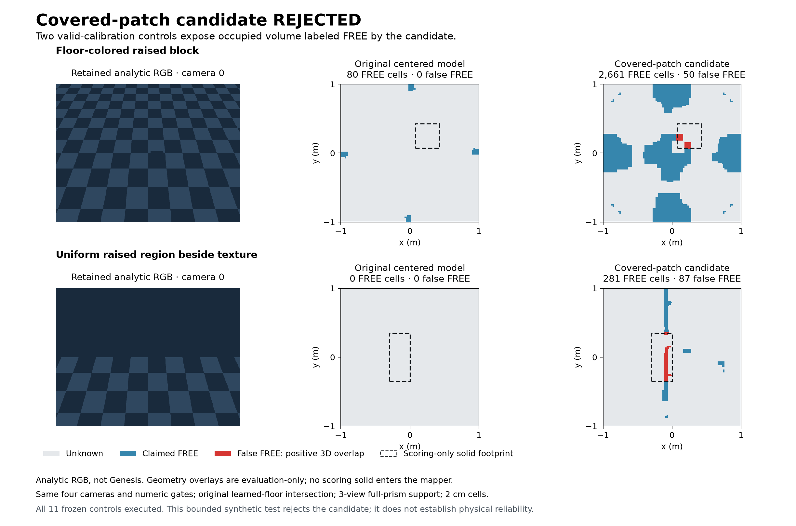

# Metric mapping repairs and rejected evidence model

The 26 September continuation repaired two reproduced implementation defects and validated them without replacing the installed map. A separate experimental mapping rule was rejected after it claimed free space inside raised floor-colored objects. General new-room driving remains unfinished; none of its six carried-forward requests was launched.

## Implemented repairs

`RoomMemory` now derives adjacent voxel faces from a single coordinate lattice. Previously, the last face of a 2 cm voxel could be calculated as `0.1 + 0.02 = 0.12000000000000001`, outside a room ending at `0.12`. A valid free-volume observation then left the entire top layer unknown. The fix changes the arithmetic association, with no epsilon or relaxed room boundary. Regression tests retain UNKNOWN for a genuinely one-ULP-short room/evidence ceiling and retain closed occupied-contact rejection.

`ScanFreeMemory.certified_route` preserves the conservative grid, A*, diagonal rules and requested clearance. If literal endpoints cannot connect under the grid's overconservative closed-cell test, it plans between the same already-free endpoint-cell centers, stitches the exact original endpoints and certifies every segment with the existing raw-memory capsule predicate. Successful baseline routes keep their original waypoints. Cached grids must match the memory and clearance. The non-visibility `ControlSession` path uses this method; generic grid and visibility-planner semantics are unchanged.

The independent counterexample was the final `(0.81,1.31) → (0.8,1.3)` connection at 0.14 m clearance. It touched an inflated blocked-cell corner even though its complete metric capsule was certified. No cell was cleared, endpoint moved or radius reduced.

## Mapping experiment and rejection

Exact replay reproduced all 6,144,000 pixels from five selected views and all 295 view-pair comparisons. None of the existing 60 views could satisfy both centered 31-pixel context and texture gates over the complete expanded goal prism. Nearby camera proposals did not predict a sufficient three-view clique, so no speculative native capture was performed.

The separately frozen candidate credited every pixel covered by a fully passing source-target comparison window, instead of crediting only its center. It retained per-pixel validity, two distinct partners, the learned floor-mask intersection, full-prism three-view support, all numerical thresholds, 0.05 m projection margin and original 0.10/0.14 m clearances. This was an explicit change in evidence locality, not a mapper bug fix.

On the existing 60 native images, it produced 32,731 FREE cells and 23,644 cells traversable at 0.14 m. The specific room audit found zero unsafe intersections among 196,386 FREE voxels. After the independent planner repair, both original routes passed every segment certificate and both occupied-goal checks rejected. Those room-specific results did not admit the model.

The first eleven analytic controls were uninformative because the voxel-layer defect suppressed every FREE claim, including the positive empty floor. They are preserved. A second frozen run retained **byte-identical 44 RGB images and 44 calibration records**, identical photometric/learned masks, partner counts and scoring truth; only the repaired implementation changed. The empty-floor positive then produced 140 centered-rule and 3,024 covered-rule FREE cells, while the uninformative uniform floor stayed unknown.

The centered rule passed this bounded set. The covered rule failed two valid-calibration controls: **50 false-FREE cells inside a floor-colored block**, and **87 inside a uniform raised region beside texture**. An inadmissible wrong-pose stress case additionally produced 53 false-FREE cells; explicit calibration admission rejected that case. Independent scalar solid-overlap scoring reproduced the failure coordinates. No thresholds were tuned after these failures.



The experimental module and candidate map remain in ignored work evidence. They were not integrated into the production floor estimator, installed assets or a driving bundle. The six original development driving requests remain blocked before launch, now explicitly by the failed model controls. They are not six additional trials, and the frozen 48-request held-out ledger remains unchanged.

## Verification

- **1,536 unique non-native Python tests pass**, with 20 native/GUI cases deselected. The full command passed 1,534 and encountered two localhost socket setup errors; the two HTTP tests passed when rerun with loopback permission. Both logs are retained.
- Ruff, JavaScript syntax and all three frontend suites pass. CI contract discovery covers 73 modules and rejects all three deliberate validator regressions.
- One separately frozen known-room, one-camera, clearance-only native regression passes: arrival at **5.15 simulated seconds**, zero contacts, localization-loss episodes, rejections, interventions or worker errors. It uses the existing installed map and does not validate the rejected candidate or general-room reliability. Native physics/rendering remain lockstep.
- Candidate model tests: 29; historical reconstruction helper: 19; endpoint capacity helper: 6; historical/current-source audit: 19; first analytic-control helper: 11; second control helper: 12; unused acquisition harness: 35. These helper counts are separate from the production suite and from physical experiments.

The runtime changes are exactly `interactive_runtime.py`, `mapping/scan_free_space.py` and `mapping/room_memory.py`, plus meaningful regression tests/adapters. All 154 pre-change producer files were archived with hashes before editing. The fresh historical/current-core audit verifies 672 evidence files, including the old producer snapshot, and separately binds the current implementation. Old frozen helpers and reports were not rewritten to pretend they used new code.

All fifteen critical installed assets, models, production memory and evaluation inputs retain their previous hashes. All original native images/evidence remain in place. Studio is unchanged and clean; repository HEADs are unchanged. Existing environments were reused. No commit, push, model download, environment replacement or memory reset occurred.

## Evidence and next gate

Fresh evidence is under `work/continuation-20260926-visual-heldout/`: `near-object-diagnosis-v1`, `development-window-coverage-v1`, `development-window-controls-v2`, and `development-metric-connector-v1`. The latter contains the source snapshot, implementation patch, full regression logs, current-core map audit, native known-room run, final preservation check and carried-forward motion ledger. The unused `development-targeted-v1` acquisition harness was tested but never frozen or captured.

The next mapping change must distinguish real floor evidence from raised floor-colored surfaces, pass informative negative controls and a fresh evaluation, then certify the original routes before the six native requests can run. Do not promote the rejected covered-window map simply because this particular room and route pass. Additional acquisition needs a demonstrated evidence mechanism; more unstructured views are not an acceptance gate.

The prior F1–F6 audit repairs and live visual-learning slice remain implemented and documented in the earlier reports. The latter learns from retained RGB interaction evidence with persistent memory and explicit Stop/Reset authority; it uses engineered entities and resource motives. This phase did not rerun its native comparison ledger or establish arbitrary semantic learning, cross-room identity, personality, physical real-time operation or hardware readiness.

Launch the established visual experiment from the repository:

```sh
./scripts/launch-control-room.sh --agency-mode visual --mode 3 --visibility-planning --scene-validity
```

The default visual memory remains `work/visual-agency/bb8.sqlite3`. Use a separate `--agency-memory` path for an isolated experiment. Stop and Reset preserve committed knowledge and revoke motion authority.

## Subsequent geometry experiment

The 27 September continuation implemented and tested a rejection-only height filter. It failed the informative-positive gate; 16 additional reference controls retained the centered rule and again rejected covered evidence. No new-room motion was admitted. [Latest evidence and next gate](FLOOR_GEOMETRY_RESULTS.md).
