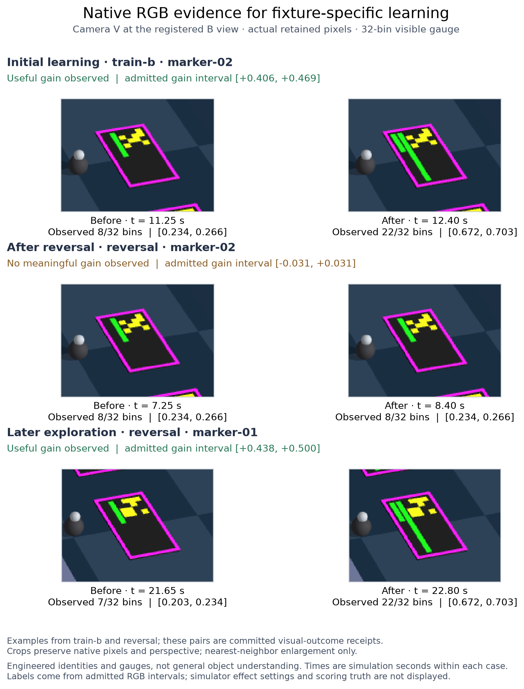
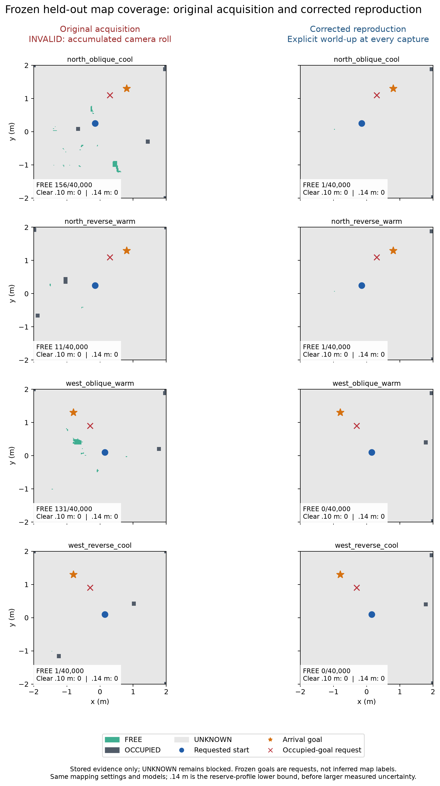
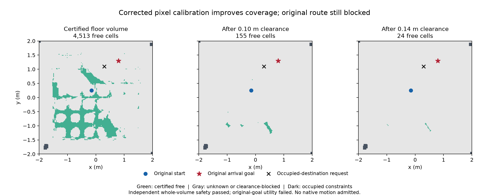
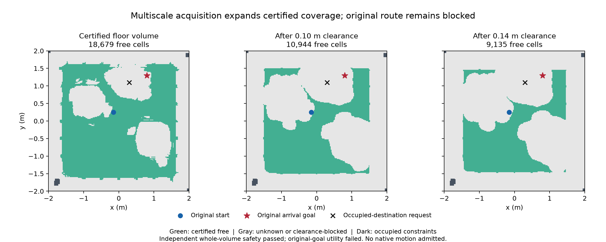

# BB8-RL: visual learning and new-room navigation

**27 September update:** original-reference scene recovery is now implemented and
verified, with all native attempts retained. Controlled point-light RGB adds a
repeatable observation method but has not established height resolution or an
admissible replacement map. The original six new-room requests remain blocked.
See [the recovery and sensing results](SCENE_RECOVERY_RESULTS.md).

The live visual-learning slice, storage hardening and camera-calibration repairs are implemented and verified. Useful new-room driving remains incomplete: the latest map is safe but still cannot certify the original route and robot footprint. This report records the completed phase and its exact remaining gate.

The earlier reproduced audit repairs remain in place: bounded recovery from unreachable routes, early effect-reversal adaptation, recursive asset dependency validation, bounded everyday logging, complete non-native CI coverage and broader run identity. The current full regression covers those repairs alongside the new visual and calibration work.

## What now works

The opt-in `visual` mode grounds two persistent entity identities, their interaction anchors, the current resource interval and learned before/after outcomes in native camera pixels. Ordinary noncolliding scene geometry renders the engineered markers and gauges. The world sends an allow-listed completion acknowledgement without numerical resource/effect values; the learner admits an outcome only after fresh visual evidence, matching authority and durable image retention. Arrival alone is not learning.

Opposite remembered histories produce different choices under identical startup images and state. With three navigation cameras and an additional registered B-view semantic camera, history A chooses marker-01 and history B chooses marker-02. Both complete an authorized interaction and learn a useful visual result. All 21 pre-enable frames have identical semantic RGB hashes, navigation images, measurements, physical starting state and scene configuration between the two probes.

Changed consequences trigger bounded re-exploration. When both entities are ineffective, eight observed ineffective interactions exhaust the probe budget and the robot idles. Stop during a pending interaction teaches nothing. Hiding the gauge after the world completes its response also teaches nothing: missing pixels cancel authority and clear the goal. Restart and Reset retain knowledge while leaving learning disabled.



The original comparative [visual evidence ledger](evidence/visual-learning-ledger.json) keeps all of its requests and failed attempts visible. Across 15 native launches, 12 cases completed and 9 passed: the original protocol passed 6/9; three supplemental startups aborted before their first frame; the separately authorized supplement passed 3/3. There are 21 admitted RGB outcomes, 8 useful. The two original one-navigation-camera history probes remain failures because candidate visibility constraints and later head detection loss prevented the intended comparison. The original hidden-response case exposed a harness sequencing bug and remains failed; the corrected separate case passes. The exact cause of the three startup aborts is unproven.

A separate native check after storage hardening passed its one selected case: three further outcomes (two useful), exact RGB/archive/SQLite parity, 3,730 physics samples, no contacts and a valid Stop tail. It is separate from the 15-launch ledger; the other eight protocol cases were deliberately not selected. Partial file writes, corrupt existing evidence, directory-sync failures and failed SQL commits now withhold learning. Atomic immutable image/receipt retention precedes the database commit, and the UI only publishes a committed outcome. This is fault-injection and native validation, not a power-loss experiment.

A further, separately frozen native compatibility case after the pixel-coordinate update also passes 1/1 with three outcomes (two useful). Across all 373 frames, saved images from every camera, measured positions, actions, controller states and scored poses are identical to the preceding storage check. The [compatibility audit](evidence/visual-calibration-compatibility-validation.json) and [frame comparison](evidence/visual-calibration-compatibility-comparison.json) are separate from the original 15-launch ledger and the storage check.

Memory ablation, random, nearest and fixed choices were compared on recorded native observations with copied histories and three ordering/random seeds. Those controls are replay comparisons, with zero additional native episodes.

## Actual app verification

The control room learned three outcomes, reached the observed 98% gauge interval and idled. Stop disabled learning. Reset restored the observed 23% starting interval, retained all three outcomes and stayed disabled. A fresh app launch after the display fix again retained three outcomes without authority. The UI now labels the observed fixture gauge and explicitly discloses the additional B-view RGB camera. Temporary test servers and the browser tab were closed cleanly.

The fixture uses a dedicated 2560×1920 B-view camera in addition to navigation modes A, A+B or A+B+C. It is a fixed synthetic marker/gauge decoder, not general object understanding, physical charging, self-created motivation or demonstrated personality. Native simulation pauses during capture/inference; these results do not establish real-time hardware performance.

## New-room navigation

A frozen 48-request evaluation covers two layouts, two camera/appearance families, camera modes 1/2/3, arrival and occupied-destination requests, and two planner variants. The first acquisition revealed a concrete camera contract bug: omitting `up` while moving a Genesis camera retained its previous orthogonalized up vector and accumulated roll. Runtime cameras used a different orientation. Those 144 captures and the original 24 native / 24 provisioning-blocked attempts are retained as fixture-invalid.

Explicit world-up at every acquisition and runtime camera pose fixes that contract. All 144 corrected images and metadata verify, all 16 query records remain pose-free, and all four families now register their four excluded queries. Estimated query camera positions are within millimetres of scoring-only synthetic truth.

The corrected maps still certify only 1 / 1 / 0 / 0 free cells, with zero traversable cells at 10 cm or 14 cm and every requested endpoint unknown. The two empty maps are blocked before native use. Safe rejection does not establish useful navigation, and the known-room map or simulator geometry is never substituted to make these routes pass.



The corrected evaluation retained all 48 requests: 24 native attempts and 24 map-provisioning blocks. Twenty initial goals were issued and all were rejected; 10 were the intended occupied-destination rejections. Four north-reverse three-camera cases never reached localization readiness because of ambiguous detections. There were zero arrivals, contacts, nonzero actions or worker errors. All 820 available fused RGB estimates and 620 measured-state estimates fell within their declared radii; the maximum raw position error was 22.11 mm. Zero motion does not establish driving reliability.

A separate development experiment added four wide mapping views on the already evaluated north-oblique family. Its first capture inherited a 20 m far clip and missed the room centre at 21.63 m depth. An explicit 25 m clip restored the room while preserving the failed attempt. These 18 m-high views are a synthetic acquisition mechanism test, not a physical in-room scanning prescription.

The strict image-agreement gate still rejected the floor. Diagnostics isolated a second concrete defect: native Genesis intrinsics use viewport coordinates, whereas the mapper samples integer array coordinates. Genesis's own ray equations and RGB readback establish the fixed -0.5 principal-point conversion; the [Khronos specification](https://registry.khronos.org/OpenGL/specs/gl/GLSLangSpec.4.60.html) also describes half-integer OpenGL pixel centres. Applying this derived correction to copied metadata restored positive floor evidence without fitting an offset or relaxing any threshold.

The implementation now supports explicit `pixel_coordinates="opencv_integer_center"` exports. The asset builder and runtime validate the convention and resize intrinsics correctly. Untagged legacy bundles keep their original behaviour; generic or externally estimated OpenCV K is never silently shifted. A fresh derivation preserves all 40 original RGB files, keeps all four query records pose-free, re-registers those queries against the established 20 mapping inputs, and recomputes all 36 positive mapping masks. Old FREE cells and masks are not automatically reused after calibration changes. All four fresh queries register successfully.

The new map certifies **4,513 free cells**, compared with one before this correction. Its independent whole-volume audit finds zero false-free voxels/prisms and passes evidence provenance. Yet only **155 cells at 10 cm** and **24 cells at 14 cm** remain traversable. The original start `(-0.15, 0.25)` and arrival goal `(0.8, 1.3)` both remain unknown with zero complete-prism supporting views. Both route checks fail; the occupied-destination requests are safely rejected. The proposed six development motion requests therefore remain unexecuted, with no alternate goals, reduced bounds or unknown-space clearing. These results do not replace the frozen 48-request evaluation.



The [map audit](evidence/pixel-center-map-validation.json) and [endpoint diagnosis](evidence/pixel-center-endpoint-validation.json) identify the remaining gate: obtain contiguous, positively supported floor volume covering the original start, destination and connecting route, then pass the same safety/clearance checks before native driving. The new-room navigation capability is not complete.

## Multiscale continuation

A read-only diagnosis reproduced every pixel of the four wide-view floor masks and separated point visibility from complete body-volume support. Nearby objects enter the required 31×31 comparison patches even where the endpoint itself is floor. A separately frozen acquisition therefore added 24 views at heights 6, 9 and 12 m, with rotated azimuths. All 24 native RGB images passed saved-pixel, K, orientation, clipping and source-identity checks. The same room, parked robot, models, goals and thresholds were retained. The closest views cover the required map/margins but do not cover the prior ±3 m outer halo; that limit is recorded explicitly.

All **60 mapping views** were processed again through the photometric and learned-mask gates. The four excluded query images stayed excluded; their existing corrected RGB registration was retained with unchanged inputs and explicit ancestry. The map now certifies **18,679 free cells**, with **10,944** cells after 10 cm clearance and **9,135** after 14 cm. Independent volume scoring finds zero false-free voxels or prisms and passes provenance. These are substantially better coverage results, but the original route still fails both clearance checks.

The original start cell now has six supporting views. An unresolved cell is only **7 cm** from the start, so the full robot footprint is not admitted. The original destination still has zero complete-prism supporting views and remains unknown. The occupied request stays rejected. No alternate goals or smaller clearances were used.



The real packaging gate was exercised and refused this map before creating a bundle. All **six planned driving requests are blocked before native launch**, with zero arrivals. A separate development packager and serialized runner are implemented and pass pure contract tests, including a delayed Stop acknowledgement, but **their live driving path is unvalidated** because map utility has not passed. They create no held-out provisioning receipt and cannot replace the original 48-request evaluation.

The continuation passes **71 helper contract tests** and Ruff. No production runtime code changed during this acquisition phase, so the earlier 1,504-test full regression and native legacy-compatibility check remain the latest such checks; they were not rerun or added to the new helper count. Independent preservation rehashed 332 unique files / 73,774,383 bytes: all 15 critical inputs, 80 original RGB/metadata files, prior map/registration bindings and the previous 123-file Python producer inventory remain unchanged. Studio is still clean and both repository HEADs are unchanged. This is separate from the earlier full 4 GB preservation audit.

The next navigation gate is a positively supported footprint around both unchanged endpoints and a certified connecting route. Geometric camera coverage and a larger free-cell count alone have now been shown insufficient. Any further perception/acquisition change needs its own frozen experiment and the same independent safety and original-route checks. General new-room driving remains unfinished.

## Metric mapping continuation — current status

The subsequent phase repaired two concrete voxel/endpoint defects and passed 1,536 non-native tests plus a known-room native arrival. A different covered-window evidence model certifies both original routes on one room, but fails informative raised-object controls and is **rejected for driving**. All six new-room requests remain unexecuted. See the [current repair and rejection report](METRIC_MAPPING_REPAIRS.md) for the preserved inconclusive controls, corrected validation, exact denominators and source snapshots. The verification section below records the earlier pixel-coordinate phase, not the latest test count.

## Verification and preservation

The final full regression after the pixel-coordinate integration passes all 1,504 non-native Python tests; 20 explicit native/GUI cases are deselected and native experiments are reported separately. Ruff, JavaScript syntax, all three frontend suites and Git whitespace checks pass. The CI contract check covers all 72 collected modules and rejects its three negative controls. The fresh derivation helper additionally passes 19 provenance, query-isolation and geometry tests. The integrated calibration/runtime/builder subset passes 158 tests.

The installed bundle, policy, vision model and production SQLite memory retain their original hashes. All 26,695 files / 4,019,793,518 bytes in the previous evidence inventory were independently rehashed and are unchanged. Existing Python environments are reused. Genesis Studio remains clean at its original revision. No commit, push, model download, environment replacement or production-memory reset was performed.

## Launch

From `/Users/rrnitish/Documents/Codex/BB8-RL`:

```sh
./scripts/launch-control-room.sh --agency-mode visual --mode 3 --visibility-planning --scene-validity
```

Wait for fresh localization and fixture pixels, then select **Start learning**. The default visual memory is `work/visual-agency/bb8.sqlite3`; use `--agency-memory /absolute/path/to/a/separate.sqlite3` for an isolated experiment. Stop and Reset preserve committed knowledge but revoke motion authority.

General new-room driving, unknown-pose scanning, automatic map repair/global relocalization, arbitrary semantic entities, cross-room identity, social interaction and hardware remain separate acceptance gates. The existing audit repairs and prior difficult-route improvements are documented in the earlier continuation/navigation reports alongside this report.

## 27 September geometry continuation

The original navigation and visual-learning ledgers are unchanged. A new rejection-only height filter was implemented and declined because its positive map was empty. New frozen controls: centered 16/16 bounded pass, covered 258 false-FREE cell claims, new filter 2 anchors executed and 14 cases blocked. No native launch occurred. [Full results](FLOOR_GEOMETRY_RESULTS.md).
