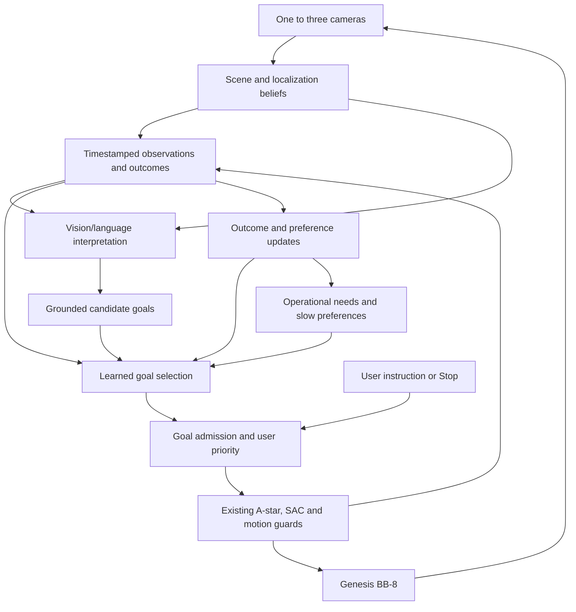

# BB-8: models for persistent autonomy and learned character

**Research cutoff: 24 September 2026.** Prepared for the separate BB8-RL project, using Genesis Studio for simulation. This is a research and design recommendation, not an implementation or benchmark result.

This research snapshot predates the implementation. See the [first experiment](../../AGENCY_PLAN.md) and [measured comparison](../../AGENCY_EXPERIMENT.md) for subsequent work.

**Recommendation:** build a persistent, learned goal-selection layer above the existing navigation system. Use a compact vision/language model to interpret situations and propose possibilities, an evidence-backed memory to retain experience, and a small policy that learns which goals are worthwhile. Treat personality as a pattern in actual choices that persists and adapts across sessions.

There is no complete, independently established, downloadable model in the reviewed evidence that already provides the requested BB-8 character. PEPA is the closest architectural match; homeostatic learning and learning-progress research better address acquired motivation. Newer general models improve perception and reasoning, but do not supply personal history or learned preferences merely by being loaded.

## What “personality” should mean in this project

The user wants BB-8 to initiate behavior and develop a character through experience. We should therefore define success behaviorally:

- It chooses worthwhile activities when no destination has been supplied.
- Past outcomes change future choices, including after a restart.
- Preferences generalize to unfamiliar situations without rigidly repeating a sequence.
- There are stable tendencies, with temporary changes due to energy, familiarity, recent events and current commitments.
- Two agents with different experiences can develop different preferences; random action sampling alone does not count.

This is a testable engineering objective. It does not establish subjective feelings or consciousness. Designers still choose an embodiment, available observations, initial biases, learning objectives and constraints. The important distinction is whether consequences shape future decisions, rather than whether the system contains any designed components.

A motor vocabulary is compatible with this objective. Navigation, waiting and processing existing camera views are useful initial capabilities. Selecting and parameterizing those capabilities from learned preferences can produce acquired behavior; replacing every primitive with an enormous neural network is not a prerequisite. Controllable gaze, head gestures and charging require additional verified interfaces.

## Where BB8-RL stands

The inspected runtime loads `GuidedSAC` and passes its predictions into `ControlSession`. Navigation uses a 50 ms **simulation-time** action period, with map, stopping and localization checks around the learned movement policy. Lockstep camera capture does not establish a 20 Hz wall-clock system. The missing component is the source of autonomous intentions above this loop. [Runtime integration](../../../src/bb8_rl/interactive_runtime.py), [guarded controller](../../../src/bb8_rl/occluded_control.py).

The research recommendation fits both single-camera scan memory and multiple-camera localization. Their estimates should enter the same high-level belief interface. A language model must not convert an old visual memory into a fresh position measurement, or turn unknown map space into certified free space.

## Closest research and what it actually establishes

**PEPA — latest paper revision 7 May 2026.** It separates personality-driven goals, deliberative decisions and sensorimotor execution. Its deployed goal reasoner uses cloud-hosted Qwen3-235B; decision generation uses LLM-MCTS with a distilled lightweight policy. However, personalities start as user-written descriptions, and quantitative personality evolution is evaluated in a rule-based sandbox over three days. The action vocabulary includes predefined emotional motions. Physical navigation demonstrations and simulated character evaluation are different evidence. This makes PEPA a useful architecture reference, rather than proof that a robot has acquired an independent personality. Read: architecture, implementation and personality experiments in the latest revision. [Paper, v3](https://arxiv.org/html/2603.00117v3).

The public project provides personality/goal prompts and links to staircase/elevator navigation repositories. Its goal-update examples explicitly produce behavioral conditions. I did not verify a complete downloadable personality learner or checkpoint. The staircase repository is MIT licensed and itself lists an unreleased planning bridge. [Project and prompts](https://sites.google.com/view/pepa-persistent/), [staircase implementation](https://github.com/zhongrenjiexing/staircase_navi), [elevator implementation](https://github.com/zhongrenjiexing/elevator_staircase_navi).

**Adaptive preferences on Mini — 2025.** A useful direct precedent for preferences learned from interaction, with a limited user study rather than demonstrated lifelong development. The underlying experimental needs are simulated. [Paper](https://www.mdpi.com/2079-9292/14/18/3711). The detailed method and study caveats are in the [robot research notes](robot-companion-research.md).

**HARMONY — accepted August 2026.** A recent physical-robot study of learned expressive adaptation; the authors explicitly distinguish this from stable psychological personality. It is an expression-learning reference, not evidence of autonomous motives. [Author manuscript](https://www.researchgate.net/publication/413453023_HARMONY_Multimodal_Spectrum-Based_Personality_Adaptation_for_Human-Robot_Interaction).

**CRISP / The Robot’s Inner Critic — ICRA 2026.** This addresses the user's concern about a fixed expression library: generated joint motions are simulated, visually critiqued and revised. Fifty participants rated simulation clips across five robot morphologies; this is evidence about perceived expression quality, not persistent motivation. BB-8 could later borrow the offline generate-and-evaluate workflow for new expressive motions, after adapting it to rolling dynamics. A visual critic's favorable rating does not certify collision avoidance. Read: motion generation, refinement, study protocol and results. [Paper](https://arxiv.org/html/2603.20164v1). The released MIT code is a **partial reference implementation** of simulation, logging and search utilities; its README explicitly excludes the end-to-end LLM/VLM generation and replanning components. [Code](https://github.com/LimJiyu99/crisp-robot-behavior).

**An evaluation warning — June 2026.** A study spanning eleven LLMs and four behavioral tasks found that stronger persona self-reports did not reliably establish matching behavior across separate sessions. The tasks were limited and largely single-turn, so this is not a universal impossibility result. It does support testing what BB-8 chooses after a restart, rather than asking a model to describe how curious or friendly it is. Read: experimental design, session separation, persona comparison and limitations. [Rethinking Psychometric Evaluation of LLMs](https://arxiv.org/html/2606.12730v1).

The parallel reviews narrow the remaining literature to the following useful components. These are different kinds of system, not interchangeable models in one leaderboard.

| Research | What to take into BB-8 | What remains unproven here |
|---|---|---|
| [Homeostatic Crafter, ICDL 2025](https://sites.google.com/view/movingsloth/projects/unexpected-capability-of-homeostasis-for-open-ended-learning) | Needs can organize learned activity without scripting each resulting strategy. | Designer-defined needs and a reported five-billion-step training budget; no transferable BB-8 character. |
| [MAGELLAN, ICML 2025](https://arxiv.org/html/2502.07709v3) | Estimate competence and choose practice goals according to learning progress. | Textual, fully observable environment; a full replication is much more expensive than the small estimator we need. |
| [DreamerV3, Nature 2025](https://www.nature.com/articles/s41586-025-08744-2) / [Director, 2022](https://papers.nips.cc/paper_files/paper/2022/file/a766f56d2da42cae20b5652970ec04ef-Paper-Conference.pdf) | Learn consequences and longer sequences of activity; use a manager above existing skills. | They do not supply BB-8's values or a pretrained personality. |
| [Active inference / pymdp](https://arxiv.org/html/2201.03904) | Interpretable comparison of information gathering and preferred outcomes. | Preferences are still supplied; a useful baseline rather than a route around objective design. |
| [WorldLines / ObsMem, June 2026](https://arxiv.org/html/2606.18847v1) | Preserve witnessed events, changing beliefs and commitments with provenance. | Small simulated evaluation; no complete author implementation verified. |
| [ABot-AgentOS, July 2026](https://arxiv.org/html/2607.10350v1) | Separate planning, skills, verification and accumulated experience. | No runnable official release verified; benchmark execution does not establish physical-robot reliability. |
| [PersonaMem-v2, December 2025](https://arxiv.org/html/2512.06688v1) | A concrete example of training preference use and memory updates. | Learning user personalization is a different objective from BB-8 acquiring its own activity preferences. |
| [PERMA, March 2026](https://arxiv.org/html/2603.23231v1) / [PersonaMem-v3, August 2026](https://arxiv.org/html/2608.21381v1) | Test changed preferences, intervening events, inappropriate personalization and silence. | Benchmarks for memory/personalization, not downloadable embodied character policies. |

The detailed notes also examine Plan2Explore, LEXA, METRA, contrastive successor features, AXIOM, social goal coordination, Generative Agents, Voyager, Concordia, MemGPT/Letta, Mem0 and ReMEmbR. Their strengths, implementation status and limitations are recorded there; their names alone are not evidence that they solve this use case.

**Why I would not replace SAC with a VLA for this milestone:** π0.5, RECAP/π*0.6, SmolVLA, OpenVLA and GR00T principally address executing and improving robot tasks. They bring embodiment and data requirements without directly supplying persistent preferences. The useful next layer selects activities above BB-8's existing motion controller. [Primary VLA comparisons and implementation audit](robot-companion-research.md).

**Why I would not install a whole memory framework by default:** a small typed event store makes observed facts, learned preferences and plans independently testable. Current Letta and Mem0 implementations differ from their historical papers; ReMEmbR's inspected code has a noncommercial research/evaluation license. These findings favor borrowing suitable mechanisms and checking exact versions before choosing a dependency. [Memory implementation audit](memory-agent-research.md).

## Foundation-model shortlist for the actual computer

The available computer is an **Apple M5 Pro with 48 GB unified memory**. These are candidates for a controlled comparison, not measured winners on this machine. General benchmark scores do not measure BB-8 character, room perception or uninterrupted performance alongside Genesis.

| Candidate | Verified release/capabilities | Proposed role and selection condition |
|---|---|---|
| **Qwen3.5-9B** | Official vision/language checkpoint, Apache-2.0. Small-family release: 2 March 2026. | First compact semantic baseline: interpret selected camera observations, retrieve context and propose structured goals. Retain only if its task-level reliability justifies the latency over 4B. |
| **Qwen3.5-4B** | Official smaller vision/language checkpoint in the same release. | Efficiency challenger. Particularly relevant when Genesis and camera inference are running simultaneously. |
| **Qwen3.8-27B** | Released 14 August 2026; official Apache-2.0 image/video model with configurable reasoning. | Quality challenger and optional slower reflection model. Compare directly against 9B; its newer release is not sufficient reason to run every decision through it. |
| **Gemma 4 E4B / 12B** | Apache-2.0 multimodal models with native audio input and structured tool use. E4B has about 8B total parameters despite its effective-size label. | Alternative if local sound/speech understanding and scene interpretation should share a model. E4B is the initial comparator; evaluate 12B if the smaller model fails important cases. |
| **Qwen3.8-Omni + Qwen-Live-Harness** | September 2026 paper and public harness; the documented desktop route uses a cloud Realtime API. | Optional later conversational front end. It adds multimodal interaction infrastructure, not a locally learned BB-8 personality. |

Sources: [Qwen 9B card](https://huggingface.co/Qwen/Qwen3.5-9B), [Qwen 4B card](https://huggingface.co/Qwen/Qwen3.5-4B), [Qwen 27B card](https://huggingface.co/Qwen/Qwen3.8-27B), [official release history](https://github.com/QwenLM/Qwen3.8), [Gemma 4 card](https://ai.google.dev/gemma/docs/core/model_card_4).

Qwen3.6-27B was also reviewed. It remains a useful older control if a 3.8 integration regresses, but is no longer the newest official 27B option. [3.6 model card](https://huggingface.co/Qwen/Qwen3.6-27B).

For context, raw four-bit storage arithmetic is roughly 4.5 GB for 9 billion parameters and 13.5 GB for 27 billion. Those are **weight-only lower-bound estimates**, excluding quantization overhead, other components, runtime buffers, visual inputs, caches and the simulator. They are not RAM measurements or speed predictions. Start with a bounded context and a small selection of useful frames; storing days of raw history in the prompt is not a memory architecture.

**Local runtime:** MLX-VLM is a practical Apple-Silicon candidate, with MIT code and documented Qwen/Gemma support. Its release history includes fixes to tool parsing, caching and image conversion. Pin and test a specific version, processor, quantization and model revision together. [Repository](https://github.com/Blaizzy/mlx-vlm), [release history](https://github.com/Blaizzy/mlx-vlm/releases).

The September 22 Qwen3.8-Omni paper is especially recent. Its interaction system combines streaming speech, asynchronous work and persistent memory; proactive monitoring uses user-defined conditions. Its benchmarks do not demonstrate learned embodied personality. The authors’ first-audio timings exclude input upload, so they cannot be read as complete robot response times. [Paper, interaction methods](https://arxiv.org/html/2609.25611v1). The Apache-2.0 harness was released September 21 and documents macOS plus a DashScope connection; open harness code does not mean the described service runs offline. [Official harness](https://github.com/QwenLM/Qwen-Live-Harness).

## What GitHub and forums changed in the recommendation

I used practitioner reports to identify experiments and integration risks, rather than treating popularity as evidence of a better personality model.

- **A concrete Mac compatibility fix:** MLX-VLM's September 9 merged change corrects the visual patch-embedding layout for Qwen3.8-27B loading/conversion. This is why checking actual runtime revisions matters even when a model is nominally supported. [Maintainer-reviewed change](https://github.com/Blaizzy/mlx-vlm/pull/2186).
- **Tool-call output is an integration boundary:** an earlier merged fix suppresses tool markup in streamed text while keeping parsed tool calls. Our proposed goal interface should consume validated structured output once, rather than treating arbitrary streamed text as a command. [Implementation change](https://github.com/Blaizzy/mlx-vlm/pull/1037).
- **Firsthand local VLM comparison:** a June 21 LocalLLaMA report tests 23 variants on 30 images with three repeats and reports substantial sensitivity to thinking mode, quantization and image settings. Its small custom dataset and hardware do not establish BB-8 rankings; its generalized explanation of why thinking hurts vision is not adopted here. It motivates testing each exact deployment configuration. [Practitioner benchmark](https://www.reddit.com/r/LocalLLaMA/comments/1ubx4rw/best_local_model_for_vision_2nd_benchmark_update/).
- **Quantized downloads are not validated deployments:** an August MLX-community author shares experimental 3.8/4.95-bit Qwen3.8 conversions and asks for feedback. The thread does not answer a subsequent peak-memory question. This is evidence of available experimentation, not a measured 48 GB deployment. [Firsthand thread](https://www.reddit.com/r/mlxcommunity/comments/1voke2g/qwen_38_27b_mlx_495_and_38_bpw_quants_on_hugging/).

The companion research notes additionally inspect recent Reachy and wire-pod owner reports. Their practical value is the separation of requested action, observed result and device health. A believable character should learn from the result that actually happened.

## Proposed BB-8 architecture

Everything below is a proposed design inferred from the research; it has not been implemented or validated in this review.

**1. Beliefs remain tied to evidence.** Store entity IDs, estimated pose/region, timestamps, camera source, visibility, familiarity and uncertainty. Distinguish observed, reported, inferred and imagined events. An occluded object can remain in memory while its current position is uncertain. A generated plan is never stored as completed experience.

**2. Persistent state has different timescales.** Keep operational variables such as energy separately from temporary activation, recent repetition and slowly learned preferences. Label simulated variables explicitly. A visit to a place can become less interesting after repeated uneventful visits, while a positive interaction can raise a contextual preference. Keep BB-8's learned activity values distinct from its model of what a user welcomes; personalization alone does not meet the user's objective. Avoid a single random “mood” value that silently controls everything.

**3. A learned model selects intentions.** Start with a small goal-conditioned value/outcome learner. Inputs include scene belief, recent outcomes, available skills, operational state, goal features and persistent preference estimates. Outputs rank feasible goals and predict consequences: information gained, likely completion, time/energy cost and interaction outcome. Train from recorded consequences rather than letting the LLM write its own success labels.

The first comparison should include a simple contextual value learner and a recurrent actor-critic over high-level goals. The latter can learn delayed consequences, such as whether an investigation leaves enough energy and visibility for a useful next activity. A contextual bandit alone cannot represent that full sequence; it is a low-cost baseline, not the final claim of persistent autonomy.

Define the initial objective explicitly: reduction of documented simulated operational deficits, improvement in competence or useful knowledge, learned contextual preference and activity costs. These terms and starting biases are design choices. Learn outcome predictions and goal values from experience, allowing interests to persist when no instruction is active. User approval may supply interaction feedback, but must not become the entire objective. Manual destination priority and Stop are authority rules outside this reward. To test the difference, hold user feedback constant while exposing agents to different learnable environments, then compare their choices in identical probe scenes.

**4. The VLM contributes meaning and possibilities.** It can suggest inspecting a changed object or revisiting an unfinished interaction, subject to observed entities and existing capabilities. The learned goal policy chooses whether to pursue a suggestion. Use structured requests containing goal type, target reference, supporting evidence and expiry. Generated explanations are useful for the UI but are not causal proof of why the policy acted.

**5. Learn stable preferences without rewarding noise.** Use predicted improvement in knowledge or competence rather than unbounded reward for surprise. Separate reducible uncertainty from camera noise: staring at a flickering image should not be more rewarding than learning about an object. Repeated goal rejection should update feasibility estimates and suppress futile retries.

**6. Maintain one motion owner.** A selected intention becomes a request to the existing session/controller. Goal admission must respect a user's active destination, Stop and loss-of-localization state. Semantic inference runs asynchronously, separate from movement stepping; wall-clock responsiveness must be measured under load. Expired model responses cannot resume a stopped robot. Any later expressive motion must use that same command ownership or an explicitly independent actuator channel.

**7. Expression follows intention and experience.** The first version can vary pause duration, approach distance and movement timing within existing validated limits. A later expressive policy can learn motion variations in simulation. BB-8 currently has a much narrower body and sensory interface than a humanoid; a language-generated gesture that needs an arm or head joint is not an executable skill.

**8. Improve the world before claiming social learning.** An empty room with anonymous obstacles only supports limited exploratory tendencies. Add visually distinguishable objects, changed layouts, meaningful activity outcomes and eventually observable interactions. Keep simulator truth restricted to evaluation, consistent with the project. Social preference experiments need actual interaction feedback; a VLM's guess about a person's feelings is not a measured reward.

With the current **fixed external cameras**, driving BB-8 closer to an object does not move its sensor viewpoint. Do not promise that approaching an occluded object reveals it. An initial “inspect” option should mean allocating visual attention to available evidence or waiting for a relevant event; active viewpoint selection would require a separately supported moving camera. Likewise, simulated rest must not be represented as actual charging without a modeled resource station and an observed resource transition.

## Experiments that would choose the best configuration

The literature narrows the candidates; it cannot determine the winning combination on BB-8. The following is a proposed evaluation program, with pass criteria to record before training.

| Question | Controlled comparison | Evidence to record |
|---|---|---|
| Does experience change behavior? | Same initial agent, different outcome histories; then matched test scenes | Choice distributions and adaptation curves with uncertainty intervals |
| Does individuality persist? | Restart process and reload state; repeat after unrelated activities | Retained preference ordering and actual decisions, not personality questionnaires |
| Is this more than a persona prompt? | Prompt-only, memory-only, learned-preference and full-system variants; identical expression | Gain attributable to learning and memory independently |
| Can it adapt rather than fixate? | Reverse an object's outcomes or move it; include misleading old memories | Recovery speed, stale-memory errors and inappropriate repetition |
| Does curiosity track learning? | Learnable objects alongside an unpredictable distractor | Time spent making progress versus repeatedly chasing noise |
| Does it work with either camera setup? | Paired scenes with one, two and three cameras; occlusion and lost localization | Goal validity, stale-goal rejection, safe stopping and appropriate waiting |
| Which semantic model is sufficient? | Qwen 4B, 9B, 3.8-27B and Gemma E4B; same recorded inputs and output schema | Object grounding, unsupported claims, schema validity, decision usefulness, p50/p95 latency and peak memory |
| Does online operation remain responsive? | Run chosen model concurrently with Genesis and camera inference | Control deadlines, inference backlog, Stop behavior and memory pressure |

Use held-out rooms, object appearances and outcome schedules. Repeat across independent training seeds; fixed replay scenes alone are insufficient to establish robustness. On semantic-model outage, abstain from new goals and wait or stop through the existing guarded controller. Keep failed cases in the denominator.

A useful first demonstration would be: BB-8 allocates attention to a new object; repeated outcomes change its preference; it recalls that experience tomorrow; and it revises its preference when the situation changes. During bounded occlusion it follows the existing controller's limits. If localization expires, the active goal is cancelled: an unfinished activity may remain in memory, but reacquisition cannot automatically resume it. These are proposed acceptance behaviors, not current capabilities.

## Build order recommended by this review

1. Define an evidence-backed event schema and collect passive decision snapshots from the current app.
2. Establish prompt-only, memory-only and simple learned-value baselines on controlled simulated outcomes.
3. Benchmark the semantic-model shortlist on those same observations, with Genesis running.
4. Add autonomous goal requests in a separate mode, preserving manual destination priority and Stop semantics.
5. Train and compare the recurrent high-level policy; test retention, preference reversal and camera occlusion.
6. Add richer objects/interactions and expressive behavior only once learned choice is demonstrated.
7. Consider Dreamer-style high-level world-model learning if prediction over longer activity sequences improves enough to justify its data and compute burden.

The proposed research contribution is the integration of **persistent learned preference, evidence-aware memory and camera-uncertainty-aware goal selection** on this embodiment. It is a hypothesis worth testing, not a verified claim of first-in-literature novelty. The choice of base language model is deliberately replaceable.

## Scope and evidence record

This review used parallel research into motivation/world models, memory/agent architectures and physical companion implementations, plus a separate check of current foundation models and Mac runtimes. Methods and experiment sections were read where accessible. The notes identify abstract-only leads, simulated versus physical experiments, and public-code gaps. Repository statements describe the versions visible at the cutoff; no model was installed, trained or benchmarked on the Mac during this review.

- [Motivation and world-model research](intrinsic-research.md)
- [Memory and agent research](memory-agent-research.md)
- [Companion robots, expression and VLA research](robot-companion-research.md)

Model cards establish released capabilities and licenses; they do not validate this application. Forum posts supply firsthand observations, not controlled comparative evidence. Where no complete author implementation was verified, the recommendation is to borrow the documented idea, not claim to reproduce the entire published system.
